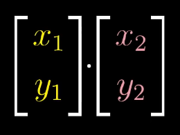
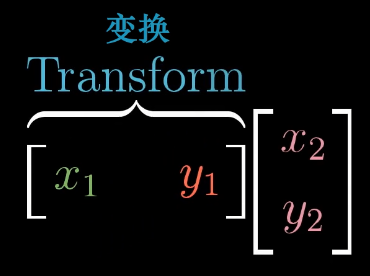
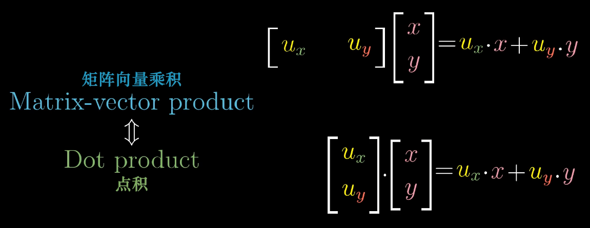

## 向量

有三种视角

物理专业：
向量是空间中箭头。二维空间里的箭头就是二维向量。
三维空间里的箭头就是三维向量。

计算机专业：
向量是有序的数字序列。

数学专业：
线性代数围绕两种基本运算：  向量加法 和 向量数乘 

## 向量加法

## 向量数乘

---
Essence of linear algebra 3/15

每当我们用数字描述向量时，它都依赖于我们正在使用的基

两个数乘向量的和被称为这两个向量的线性组合。

## 张成空间
所有可以表示为给定向量线性组合的向量的集合 被称为给定向量张成的空间(span)

对于大部分二维向量，它们的张成空间是所有二维向量的集合。
但当它们共线时，它们的张成空间是一条直线上向量的集合。

两个向量张成的空间实际上是问：仅通过向量加法与向量数乘这两种基础运算，你能获得的所有可能向量的集合是什么？

## Linearly deperder 线性相关

当2个向量落在同一直线时，我们称它们是 线性相关 的。

或者说 这个向量可以表示为其它向量的线性组合，因为这个向量已经落在其他向量张成的空间之中。

## Linearly independent 线性无关

如果所有向量都给张成的空间增添了新的维度，它们就被称为是线性无关的。

基的严格定义：
向量空间的一组基是张成该空间的一个线性无关的向量集。

## 线性变换的概念 以及它和矩阵的关系

Linear transformations and matrices | Essence of linear algebra, chapter 3

## Linear transformations

变换实质上是 函数一种 花哨说法。
它接收输入内容，并输出对应结果。

接收一个向量，并且输出一个向量的变换。

满足下面2点就叫线性变换：
直线依旧是直线。
原点必须保持固定。

## 行列式

测量一个给定区域面积增大或减小的比例

一个矩阵的行列式 是说它【矩阵】将一个区域的面积增加为原来的3倍。

三维中，是将一个区域的体积的缩放。

##

## 逆矩阵

## 跌
变换后空间的维数

## 列空间
矩阵的列所张成的空间

## 点积/内积

2个疑问？
1-为什么点积相乘，两个向量交换前后位置也没有关系。【就是不像叉乘那样】  
2-为什么 对应坐标相乘并将结果相加，会和投影有所联系。

对偶性 能解决 第2个问题？还真解决了。

把两个向量点积，看成一个矩阵对另一个向量的 线性变换。

其实等于

所以 两个向量的点积 才 等于：

x1*x2 + y1*y2

把一个存在于 二维空间的向量，压缩到一个 一维空间里 的一条线上去。

<!---
	mygod，这不就是 二向泊 攻击么！-->

不过点积是数，矩阵乘法是向量，两者仅数值相等，不完全相等。

而当2个向量垂直时，它们的点积为0.
可以理解为 这个向量在被压缩到一维空间里时，它的终点落到了原点处。

线性变换时，等距分布的点保持等距分布。

否则，如果这些点没有等距分布，那么这个变换就不是线性的。

1×2 矩阵 相当于 二维平面中的一维数轴，然后变换2×1的坐标点到数轴上。

这就是为什么与单位向量的点积可以理解为 将向量投影到单位向量所在直线上所得到的投影长度。

而与非单位向量的点积，可以理解为，先朝数轴上投影，然后将结果乘以非单位向量相对于单位向量长度的比例。

## 叉积

两个2维向量 叉乘 ，构成了一个 三维向量。

