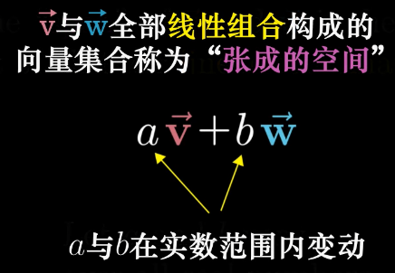
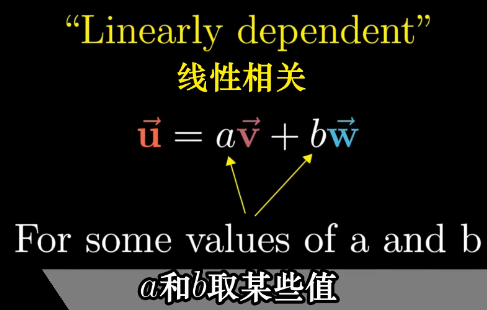
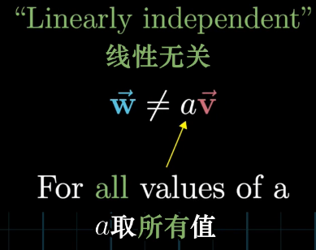
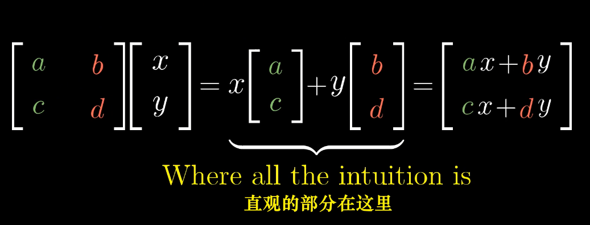

## 向量

有三种视角

物理专业：
向量是空间中箭头。二维空间里的箭头就是二维向量。
三维空间里的箭头就是三维向量。

计算机专业：
向量是有序的数字序列。

数学专业：
线性代数围绕两种基本运算：  向量加法 和 向量数乘 

## 向量加法

## 向量数乘

---
Essence of linear algebra 3/15

每当我们用数字描述向量时，它都依赖于我们正在使用的基

两个数乘向量的和被称为这两个向量的线性组合。

## 张成空间
所有可以表示为给定向量线性组合的向量的集合 被称为给定向量张成的空间(span)

对于大部分二维向量，它们的张成空间是所有二维向量的集合。
但当它们共线时，它们的张成空间是一条直线上向量的集合。

两个向量张成的空间实际上是问：仅通过向量加法与向量数乘这两种基础运算，你能获得的所有可能向量的集合是什么？

## Linearly deperder 线性相关

当2个向量落在同一直线时，我们称它们是 线性相关 的。

或者说 这个向量可以表示为其它向量的线性组合，因为这个向量已经落在其他向量张成的空间之中。

## Linearly independent 线性无关

如果所有向量都给张成的空间增添了新的维度，它们就被称为是线性无关的。

基的严格定义：
向量空间的一组基是张成该空间的一个线性无关的向量集。

## 线性变换的概念 以及它和矩阵的关系

Linear transformations and matrices | Essence of linear algebra, chapter 3

## Linear transformations

变换实质上是 函数一种 花哨说法。
它接收输入内容，并输出对应结果。

接收一个向量，并且输出一个向量的变换。

满足下面2点就叫线性变换：
直线依旧是直线。
原点必须保持固定。

## 行列式

测量一个给定区域面积增大或减小的比例

一个矩阵的行列式 是说它【矩阵】将一个区域的面积增加为原来的3倍。

三维中，是将一个区域的体积的缩放。

##

## 逆矩阵

## 列空间

## 

