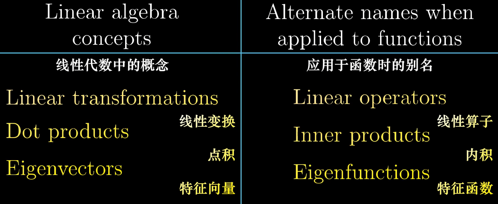

学习视频：「线性代数的本质」

参考资料：
理解矩阵-孟岩
>http://blog.csdn.net/myan/article/details/647511

## 线性空间

**这个空间可以容纳运动，这里我们所说的运动是从一个点到另一个点的移动（变换），而不是微积分意义上的“连续”性的运动，容纳运动是空间的本质特征。**

**事实上，不管是什么空间，都必须容纳和支持在其中发生的符合规则的运动（变换）。你会发现，在某种空间中往往会存在一种相对应的变换，比如拓扑空间中有拓扑变换，线性空间中有线性变换，仿射空间中有仿射变换，其实这些变换都只不过是对应空间中允许的运动形式而已。**

因此只要知道，**“空间”是容纳运动的一个对象集合，而变换则规定了对应空间的运动。**

2个问题：
1.空间是一个对象集合，线性空间也是空间，所以也是一个对象集合。
那么线性空间是一个什么样的对象的集合？或者说，线性空间中的对象有什么共同点么？

2.线性空间中的运动如何表述的？也就是线性变换是如何表示的？

一：
**线性空间中的任何一个对象，通过选取基和坐标的方法，都可以表达为向量的形式。**

二：
线性空间中的运动，被称为线性变换。线性变换如何表示呢？**在线性空间中，当你选定一组基之后，不仅可以用一个向量来描述空间中的任何一个对象，而且可以用矩阵来描述该空间中的任何一个运动（变换）。而使某个对象发生对应运动的方法，就是用代表那个运动的矩阵，乘以代表那个对象的向量。**

简而言之，**在线性空间中选定基之后，向量刻画对象，矩阵刻画对象的运动，用矩阵与向量的乘法施加运动。**

**矩阵的本质是运动的描述。**

也可以说：

**矩阵是线性空间里的变换的描述**

## 向量

有三种视角

物理专业：
向量是空间中箭头。二维空间里的箭头就是二维向量。
三维空间里的箭头就是三维向量。

计算机专业：
向量是有序的数字序列。

数学专业：
线性代数围绕两种基本运算：  向量加法 和 向量数乘 

## 向量加法

## 向量数乘

---
Essence of linear algebra 3/15

每当我们用数字描述向量时，它都依赖于我们正在使用的基

两个数乘向量的和被称为这两个向量的线性组合。

## 张成空间
所有可以表示为给定向量线性组合的向量的集合 被称为给定向量张成的空间(span)

对于大部分二维向量，它们的张成空间是所有二维向量的集合。
但当它们共线时，它们的张成空间是一条直线上向量的集合。

两个向量张成的空间实际上是问：仅通过向量加法与向量数乘这两种基础运算，你能获得的所有可能向量的集合是什么？

## Linearly deperder 线性相关

当2个向量落在同一直线时，我们称它们是 线性相关 的。

或者说 这个向量可以表示为其它向量的线性组合，因为这个向量已经落在其他向量张成的空间之中。

## Linearly independent 线性无关

如果所有向量都给张成的空间增添了新的维度，它们就被称为是线性无关的。

基的严格定义：
向量空间的一组基是张成该空间的一个线性无关的向量集。

## 线性

"线性"的代数意义是什么呢？
最基本的意义只有两条：可加性 和 比例性。

f(x1 + x2) = f(x1) + f(x2)

比例性：也叫做齐次性，数乘性 或 均匀性
f(kx) = kf(x)

## 线性变换的概念 以及它和矩阵的关系

Linear transformations and matrices | Essence of linear algebra, chapter 3

## 矩阵 ，Linear transformations

变换实质上是 函数一种 花哨说法。
它接收输入内容，并输出对应结果。

接收一个向量，并且输出一个向量的变换。

满足下面2点就叫线性变换：
直线依旧是直线。
原点必须保持固定。

**矩阵是线性空间中的线性变换的一个描述。在一个线性空间中，只要我们选定一组基，那么对于任何一个线性变换，都能够用一个确定的矩阵来加以描述。**

**对于一个线性变换，只要你选定一组基，那么就可以找到一个矩阵来描述这个线性变换。换一组基，就得到一个不同的矩阵。所有这些矩阵都是这同一个线性变换的描述，但又都不是线性变换本身。**

这2个矩阵就是互为相似矩阵。**所谓相似矩阵，就是同一个线性变换的不同的描述矩阵。**

那n阶矩阵只能作为 线性变换的描述么？ 
不是的，它还可以做为坐标系的转换。 反过来想，矩阵不是让线性空间中的向量运动了，而是把坐标系移动了，所以向量的值才变了。

换句话说，**运动是相对的**。（物理里面的相对运动）  
矩阵即可以是 描述对 向量的线性变换，也可以是 对 坐标系的 线性变换。

## 行列式

测量一个给定区域面积增大或减小的比例

一个矩阵的行列式 是说它【矩阵】将一个区域的面积增加为原来的3倍。

三维中，是将一个区域的体积的缩放。

行列式的几何意义 就是 列向量 所围面积，体积。

##

## 逆矩阵

## 跌
变换后空间的维数

## 列空间
矩阵的列所张成的空间

## 点积/内积

2个疑问？
1-为什么点积相乘，两个向量交换前后位置也没有关系。【就是不像叉乘那样】  
2-为什么 对应坐标相乘并将结果相加，会和投影有所联系。

对偶性 能解决 第2个问题？还真解决了。

把两个向量点积，看成一个矩阵对另一个向量的 线性变换。

其实等于

所以 两个向量的点积 才 等于：

x1*x2 + y1*y2

把一个存在于 二维空间的向量，压缩到一个 一维空间里 的一条线上去。

<!---
	mygod，这不就是 二向泊 攻击么！-->

不过点积是数，矩阵乘法是向量，两者仅数值相等，不完全相等。

而当2个向量垂直时，它们的点积为0.
可以理解为 这个向量在被压缩到一维空间里时，它的终点落到了原点处。

线性变换时，等距分布的点保持等距分布。

否则，如果这些点没有等距分布，那么这个变换就不是线性的。

1×2 矩阵 相当于 二维平面中的一维数轴，然后变换2×1的坐标点到数轴上。

这就是为什么与单位向量的点积可以理解为 将向量投影到单位向量所在直线上所得到的投影长度。

而与非单位向量的点积，可以理解为，先朝数轴上投影，然后将结果乘以非单位向量相对于单位向量长度的比例。

## 叉积

视屏：以线性代换的眼光看叉积

问题：叉积的计算过程有什么几何解释么？

构建几何理解的计划：

体积是一个数字（一维），而底面积是一个常数，变量就是高，所以这是一个3维到1维的映射。

<!---已知三个向量，求体积为：
	(a×b)*c
a 和 b 叉乘，然后结果和 c 点乘。-->

等式右边是 三个向量 的 行列式，也就是 三个向量围起来 六面体的体积。

所以P向量就是 v和w 的 叉乘。P向量的大小就是 v和w 组成的底的 面积的大小。

**计算角度**   

	当你将向量p和某个向量(x,y,z)点乘时，所得的结果是一个3×3矩阵的行列式，这个矩阵的第一列为(x,y,z),其余两列为 v 和 w 的坐标，
	什么样的向量P才能满足这一特殊性质？

**几何角度**

	当你将向量p和某个向量(x,y,z)点乘时，所得结果等于一个由(x,y,z)和v与w确定的平行六面体的有向体积，
	什么样的向量P才能满足这一特殊性质？

根据前面学习点乘的几何意义的知识，这个向量p当然是垂直于 V和W的向量，且大小是V和W的面积。

因此我们之前通过特殊符号技巧进行计算所得到的向量p必然在几何上与这个向量对应。

这就是 叉积的计算过程与几何解释有关联的根本原因。

**总结推理过程**

	首先定义了一个三维空间到数轴的线性变换，并且它是根据向量v和w来定义的。

	然后通过两种不同方式来考虑这个变换(x,y,z)的对偶向量P。
	既线性变换和 变换与对偶向量P点乘等价。

	而另一方面，计算方法引导你使用下面这种技巧：
	在矩阵第一列中插入i帽,j帽,k帽,然后计算行列式

【大学课本里面一般是这样写的】

【隐藏副本-四元数：叉积也可以用四元数来表示。注意到上述 i,j,k之间的叉积满足四元数的乘法。一般而言，若将向量[a1, a2, a3]表示成四元数a1i + a2j + a3k，两个向量的叉积可以这样计算：计算两个四元数的乘积得到一个四元数，并将这个四元数的实部去掉，即为结果。更多关于四元数乘法，向量运算及其几何意义请参见四元数与空间旋转。】

	但是从几何角度思考，我们可以推断出这个对偶向量，必然于V和W垂直，且长度与这两个向量张成的平行四边形的面积相同。

【这里应用了行列式是单位体积放大倍数也就是实际体积的概念】

	这两种方法给出了同一个变换的对偶向量，因此这两个向量必然相同。

## 基变换

“Mathematics is the art of giving the same name to different things”

数学是一门赋予不同事物相同名称的艺术。  -昂利.庞加莱

ihat 和 jhat 被称为这个标准坐标系的基向量。

不同坐标系的基不同，但是大家都默认原点是在同一个位置。

一个问题：我们如何在不同坐标系之间进行转化？

答：用矩阵乘法。这个矩阵M就是要转换的坐标系的基向量构成。

M乘以要转换的向量 就转换成了向量在这个坐标系的样子了。

要再转换回去，取矩阵M的逆就好了。

这个知识点，搞图形学 可以好好看一看。

表达式 A^(-1)MA 暗示着一种数学上的转移作用。中间的矩阵代表一种你所见的变换，而外侧两个矩阵代表着转移作用，也就是视角上的转化。

几何意义：一个别的坐标系描述的向量 乘以A矩阵，把向量变换到我们这个一个坐标系，这时再乘以M变换矩阵，比如M矩阵的意思为 把所有向量旋转90度，然后这时再乘以A矩阵的逆，把向量变换到 原来的坐标系去。

【这里矩阵框的颜色 和 数字的 颜色，真有心了】

这样子， M矩阵就是用来对我们这个坐标系 描述的向量旋转90度。   
而 A^(-1)MA 这3个矩阵的复合 则是对那个坐标系下描述的向量 进行的旋转90度。

【先变为我们的坐标表示，用我们的方式旋转，之后再变为她的表示】

这就是相似矩阵啊。看下大学课本里的相似矩阵定义：
	
	P^(-1)AP = B
	这时，称矩阵A与B“相似”。B称作A通过相似变换矩阵：P得到的矩阵。术语相似变换的其中一个含义就是将矩阵A变成与其相似的矩阵B。

实际应用：  
相似变换是为了简化计算。如果把复杂的矩阵变换成对角矩阵，作用完了之后再变换回来，比如求解矩阵的n次幂！
	
傅立叶变换 其实就是一个基变换。

## 特征向量Eigen vectors与特征值Eigen values
/本征值【数学物理方程的研究领域叫本征值】

想要能理解 几何意义，必须有如下的 预备知识：

在对坐标系里面 所有的向量进行 矩阵变换时，有些向量 没有离开自己的张量空间，也就是说 变换前，变换后，都在同一条直线上，而有些向量 则离开了【比如旋转了几度】。 这些没有离开自己的张量空间的 向量 叫做 特征向量。

每个 特征向量 在变换过程中 都有特征值，即 衡量特征向量 在 变换中 拉伸或压缩比例的因子。

矩阵向量乘积 = 向量数乘

所以求解向量A的 特征向量 和 特征值,其实就是求解 使得这个等式成立的
向量V和数λ。

但是 有些变换，可能没有 特征向量，也没有实数的特征值，比如所有向量旋转90度。

**矩阵特征值是对特征向量进行伸缩和选转的度量**，实数只是进行伸缩，虚数是只进行旋转，复数就是有伸缩有旋转。其实最重要的是特征向量，从它的定义可以看出来，**特征向量是在矩阵变换下只进行"规则"变换的向量，这个"规则"就是特征值**

如何求解特征值呢？

I是单位向量。
(A-Iλ) = 0向量 时， 说明矩阵变换把整个空间都降维了。V向量给压缩到原点去了。

**特征基**

如果变换后，即不共线的特征向量个数>=维数时，这些不共线的特征向量可以组成特征基。

对角矩阵 的解读：

所有基向量都是特征向量，矩阵的 对角元是它们书属的特征值。

然后求变换矩阵的相似矩阵。视角变换和逆 选择的是 2个基向量的坐标（1，0）和（-1，1）

这个新矩阵必然是对角的，并且对角元为对应的特征值。
这是因为，它所处的坐标系的基向量在变换中只进行了缩放。

就是说这个变化矩阵 如果换到特征向量为基的空间就是只是两个基做了缩放。

实际可以解决的问题：

[3 1]   
[0 2] 这个矩阵的100次幂。

---
问题：为什么需要特征基？

前面我们已经知道，在不同的坐标系下面，同一个向量有不同的坐标。而这些坐标有的适合在某种场景下面进行运算。也就是说这些坐标是有优劣之分的。

**特征向量的引入是为了选取一组很好的基。空间中因为有了矩阵，才有了坐标的优劣。对角化的过程，实质上就是找特征向量的过程。**如果一个矩阵在复数域不能对角化，我们还有办法把它化成比较优美的形式——Jordan标准型。高等代数理论已经证明：**一个方阵在复数域一定可以化成Jordan标准型**。这一点有兴趣的同学可以看一下高等代数后或者矩阵论。

---

**坐标有优劣，于是我们选取特征向量作为基底，那么一个线性变换最核心的部分就被揭露出来——当矩阵表示线性变换时，特征值就是变换的本质！**

这里面还有很多应用解释：
>https://www.zhihu.com/question/21874816/answer/85155697

实际应用：

特征值eigenvalue和特征向量eigenvector的一大应用是用于大量数据的降维，这个方法叫做Principle Components Analysis，有兴趣的同学可以wiki一下。

求转动主轴时数学做法与求特征向量如此一致。

四元数，旋转矩阵，这里全都可以串起来了。

## 抽象向量空间

这些公理，同其他动机不明的定义一起，让门外汉难以掌握数学。
它们主要通过这样的方式协助数学家，从而提升数学的权威性。

走向泛函分析，哈哈。

把函数想象成一个无限维的向量。

对向量所能进行的操作不过相加和数乘两种。

所以前面我们学的很多线代的知识，都能直接用到函数里面去。

**线性变换**

将一个函数变换到另一个函数。 比如导函数。

这里和 线性算子 一样。

线性的严格定义，不仅适用于箭头，也适用于函数。 

满足以下两条性质的变换是线性的。

求导是线性运算。 所以求导运算是可以写成一个变换矩阵的。

我们选 1，x, x^2, x^3, .... 来做为基。这样求导的变换矩阵就如下：

所以线性代数中很多概念在函数里面有对应：

**这些类似向量的事物，比如箭头，一组数，函数等，它们构成的集合被称为
向量空间 Vector spaces**。

如果你是一个开宗立派的数学家，你准备建立线性代数，你所需要做的是建立一系列向量加法和数乘必须遵守的规则：

这些规则被称为 公理。

如果要让所有已经建立好的理论和概念适用于一个向量空间，那么它必须满足八条公理。

公理不是自然法则，而只是一个媒介。一边连接着你，定义公理的数学家。一边连接着其他人，也就是想要把这些结论应用于新的向量空间的人。

所以这个公理和程序里面的接口一样。有的人定义了接口，调用接口的人，只要满足接口的规矩，就能成功调用这个函数。 

数学的公理，是其他学科利用数学工具的媒介接口。

而要这个接口能够用到很多方面，那就要抽象。

**普适的代价是抽象**。

这就是教科书中和课堂上更倾向于抽象表述的根本原因。

正如形象的代价是狭隘。

完结！！！

2天时间学完这个系列视屏！接下来几天就是看书做题，巩固理解，抽象化！

 

