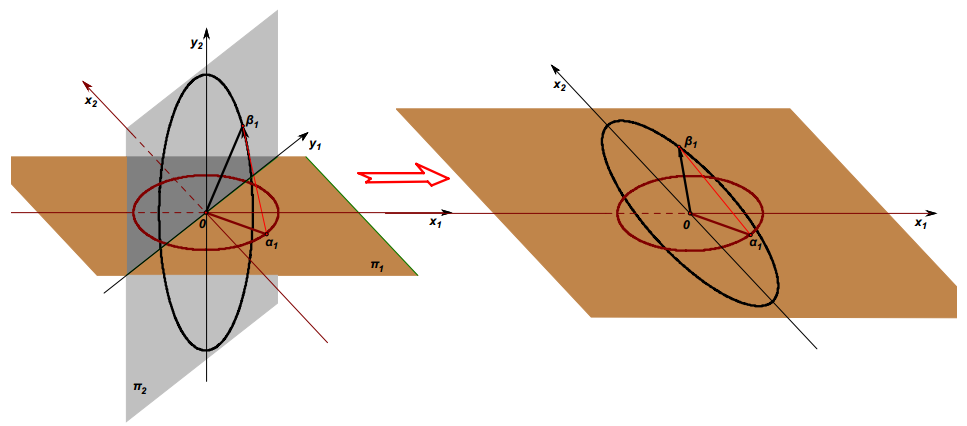

## 第1章 什么是线性代数

第1章 主要讲解了 **线性映射** 和 **线性变换** 的几何意义。映射的话 其实 是从 集合的角度看待问题了。

<!-- 书里的图 好像都是 幻灯片画出来的，公式的编写 也明显不是 latex 编辑的-->

#### 线性变换的几何意义：

在大多数的教科书中，**线性映射**和**线性变换**被区别为两个概念。如果映射是发生在一个集合上的同一个坐标系中，线性映射就被称为线性变换。线性变换作为线性映射的特例，就是把集合上的两个坐标系合为一个。

如果把二维平面圆->椭圆的映射整合成变换的例子如下如图所示。

<!-- 然后历史上： 居然是先有了 四元数 的概念，然后才有了 向量的点积，叉积的概念....标量，向量的概念 一开始诞生的时候 就是和 四元数 一起诞生的，而现在的教学 都把 四元数 和 三维向量 分离开教学了，在初高中时就能接触到三维向量，但是四元数的概念则是大学很久以后才接触到。果然脱离历史的教学 简直有毒-->

## 第2章 向量的基本几何意义

<!-- 高中 数学 物理知识 复习.-->

直积，张量，也叫做向量的张量积，俗称 并矢

**张量-Tensor**：**通俗的理解就是，只有大小但是不需要知道方向即可表示的就是标量（零阶），还需要知道一个方向才能表示出来的叫矢量（一阶），需要多重方向才能表示出来的叫张量（二阶，或者二阶以上）**

张量的定义为：由若干坐标系改变时满足一定坐标转化关系的有序数组成的集合。

**张量是矢量和矩阵概念的推广**。标量是0阶张量，矢量是一阶张量，矩阵是二阶张量，而三阶张量好比立体矩阵，更高阶张量则无法用图形表示。

**张量出现的背景**：物理学家要用数学量来表示物理量，可是标量加上向量都不能完整地表达所有的物理量，所以物理学家使用的数学量的概念就必须扩大，于是张量就出现了。

当时的数学家想到，实数可看作一维向量，复数可看作二维向量，那么一定还有“三维数”、“四维数”，乃至“n维数”。令人失望的是，哈密尔顿发现，要形成有加减乘除四则运算的数系，只能是四元数，而且不得不放弃乘法的交换律。最后发现的八元数，连结合律也维持不了。除此而外，其他维数的向量，根本无法定义四则运算，谈不上
构成数系。

## 第五章 矩阵的几何意义

<!-- 也就最后一章可以看看，3，4 章都是在 打酱油-->

看看旋转矩阵，镜像矩阵。

