## Cayley-凯勒图

《Visual_Group_Theory[Nathan_Carter]》这本书里面给出了很多群里的应用：比如化学，视觉艺术，舞蹈，数学。

**群的元素 可以为 数字，可以为矩阵，可以为对称操作，“群乘”运算为相继的两个对称操作。**

下面的很多例子都是把 群元素 当作 对称操作 来说的。

第1步为对象的部分编号，以便我们可以跟踪步骤2中允许的操作。也就是说，它使我们能够区分所有对象的不同状态，并查看它们之间的关系。 请注意，新的每个状态是对象的类似部分的新安排，即重新安排。 编号允许我们清楚地描述这些重排的每一个，否则这些重排将彼此不可区分。

01：第1步，为对象的部分编号。

02：第2步，所能进行的对称操作有哪些。

03：

下面我们拿一个长方形来举例，看看它有哪些对称操作。

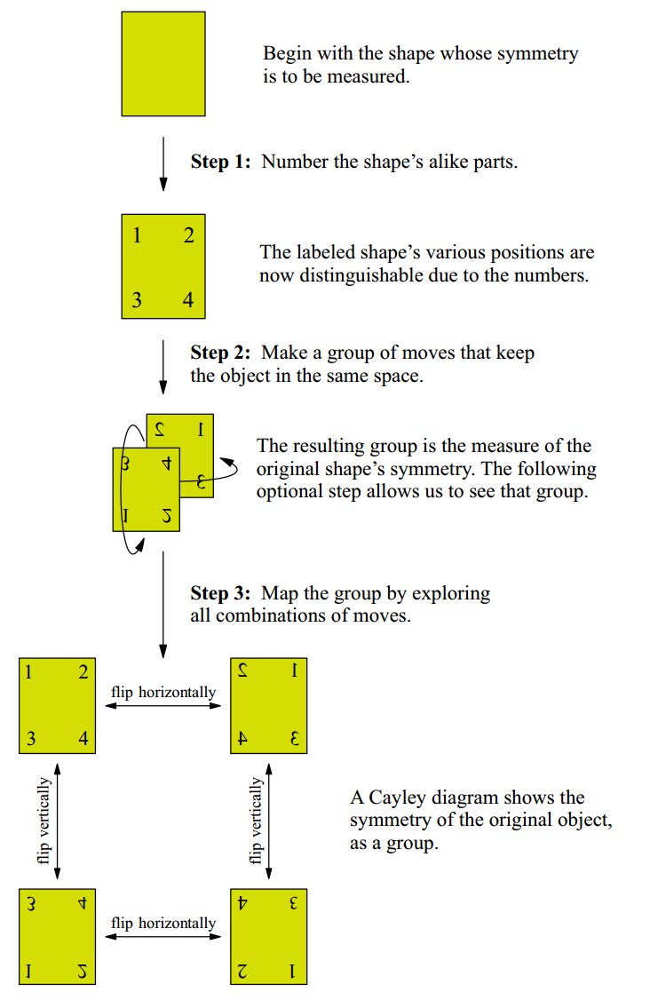

然后可以转化成下面这张图片：

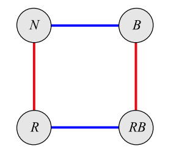

我们用:N,B,R,RB代表4种操作。蓝线代表水平翻转，红线代表竖直翻转。

N：表示“不采取任何行动”

B：水平翻转

R：竖直翻转

RB:竖直翻转后再水平翻转。

我们可以知道: RB=BR. 先竖直翻转后再水平翻转=先水平翻转后再竖直翻转。

这些操作可以互相相乘：$RRRBRRBBB=R^3BR^2B^3 = R$

#### Multiplication tables-乘法表

把这4种操作可以列出一张表格：

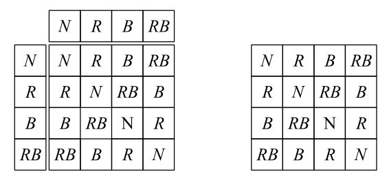

左图是完整版乘法表，行标题和列标题已成为表格本身的一部分，所以可以省略第一行和第一列，变成右图的样子。【能省略的原因还是因为有N存在，并且放在第1个，这里 N其实就是e,单位元】 

其他表格：

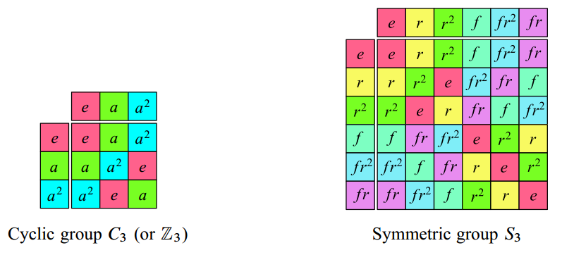

我们学到了两个强大的群理论可视化技术：凯莱图将群显示为行动的集合，乘法表将群显示为二元操作。

#### 5.1 Cyclic groups - 循环群

描述仅具有旋转对称性的对象。

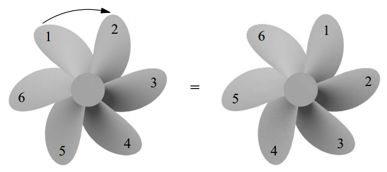

可以看到如果我们左右翻转的话，就不会对称了，所以这个 螺旋桨 只有 旋转对称。

对应的 cayley diagram 是下图中间那个:

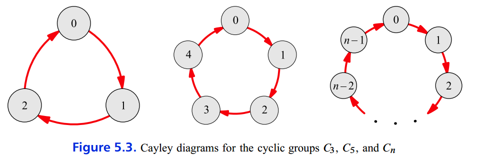

对应的乘法表格，这个表格叫$C_5$,也可以叫$Z_5$，因为元素都是整数的原因。：

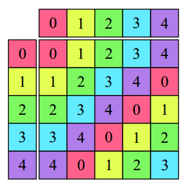

$C_{12}$ 就像 挂在墙上的时钟一样。同时也像 模12 的计算。

**$C_n$ 群 都是 循环群，没有 翻转对称操作。**

#### 5.2 Abelian groups - 阿贝尔群

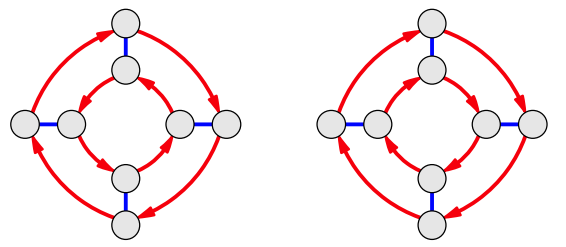

左边 就不是 阿贝尔群，右边是 阿贝尔群。右图任一元素 走红色箭头再走蓝色线 = 走蓝色线再走红色箭头。 

红色和蓝色操作 互换不影响结果。

阿贝尔群 的 乘法表格：

沿对角线对称。右上角 跟 左下角 互相成为 镜像。比如 上面那个 $C_5$图。

#### 5.3 Dihedral groups - 二面体群

二面体群 是  正多边形Regular polygon 的对称操作 组成的群，记为 $D_n$。

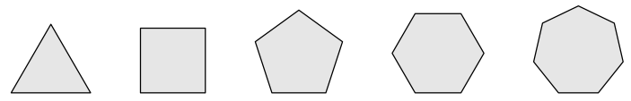

上图是 5个 正多边形。

可以得知 正三角形，有6个对称操作=3个旋转操作+3个翻转操作。前面学习循环群我们已经知道，$C_3$的元素个数为3.

$D_n$ 群的元素 = 2 × $C_n$群的元素。

对应的 cayley diagram：

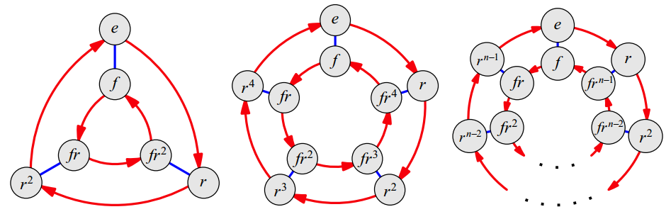

第1个就是 正三角形。蓝线代表左右翻转，红线代表逆时针旋转120度。

【想想 这里 外环 和 内环 的箭头方向 为什么不一样？或者说为什么不是一个阿贝尔群？】

至于乘法表，在前面有显示，就是$S_3$那张。

$frf=r^{-1}$， 这个公式眼熟吧，好像 相似矩阵 的定义。

下面我们来观察一下 $D_5$的乘法表格。

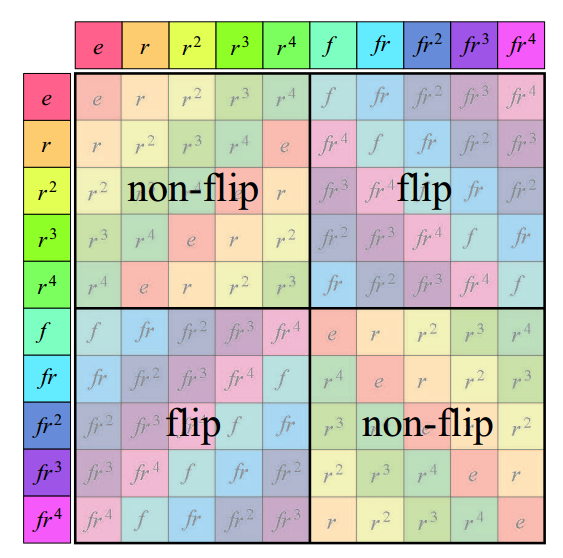

可以看出下面这些规律：

Any non-flip times a non-flip is a non-flip.
Any non-flip times a flip is a flip.
Any flip times a non-flip is a flip.
Any flip times a flip is a non-flip.

#### 5.4 	Symmetric and alternating groups - 对称群 和 交错群/交代群

Permutation groups - 置换群/排列

我们 把 排列组合 的所有可能 组成 的集合叫做 置换群。记为 $S_4$，这里是指 Symmetric,对称性的意思。

$S_4=4×3×2×1=24$， 元素个数就是按照 阶乘来计算。下面是 $S_4$的 凯勒图：

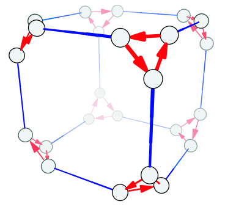

比较巧的是：$S_3$与$D_3$具有相同的凯勒图：元素都是6个。？ 好像不同

$S_5$像个足球。

$S_n$的一半元素构成的群 叫做 alternating groups [交错群], call $A_n$。

比如 $A_3$就只有3个元素，凯莱图与 $C_3$一样。

在3维世界中，只有5个正立方体。【高中几何知识】

凯勒定理1：Every group is isomorphic to a collection of permutations.

看不懂这个定理的证明。

## Chapter 06: Subgroups

regular： 凯勒图 的正则性。正则子群。

比如  $D_3$ 里面包含的那个 $C_3$，就是 $D_3$的正则子群。

因为 $D_3$ 中的任一元素$r$，满足 $frf$ 仍然 在 $D_3$ 里面，即它在 共轭变换下不变。

 

regular 正则性 向我们展示了 群体如何 体现对称性。 我们现在已经在 使用 群 来衡量对称性。并说 凯勒图 真实地表示了 群。

When a group $H$ is a subgroup of a group $G$, the standard way to write this is $H < G$.  

子群必须含有 e

#### 6.4  Cosets

那些与子群对称的子群（但是不含有e）就叫做 cosets 陪集

Observation 6.3. Every subgroup has cosets, and they cover every node of the group's
Cayley diagram.

一个子集 加上 所对应的 所有 陪集 确实 覆盖了群里所有元素。

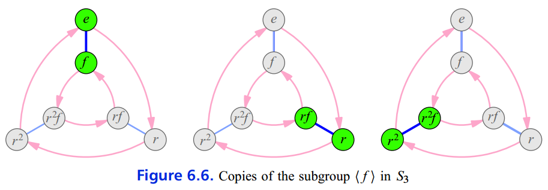

比如上图中，左边是 子集，右边2个是对应的 陪集。

Observation 6.4. We can also describe cosets algebraically. The copy of $H$ based at $a$ is named $aH$.

比如上图中，$H=\left \{ e,f \right \}$,同时可以写为 $\left \langle f \right \rangle$ 。中间的陪集可以写为 $r\left \langle f \right \rangle$ , 右边的陪集可以写为 $r^2\left \langle f \right \rangle$

陪集计算方式:

$r\left \langle f \right \rangle = r \left \{ e,f \right \} = \left \{r \cdot e,r \cdot f \right \}=\left \{ r,rf \right \}$

For this reason all the cosets we have seen are actually called **left cosets**, because the multiplication is done on the left.

当然后面我们会见到右陪集。

Observation 6.5. Each coset can have more than one name.

比如 $r^2\left \langle f \right \rangle = r^{-1} \left \langle f \right \rangle$

右陪集

$\left \langle f \right \rangle r= \left \{ e,f \right \} r= \left \{e \cdot r,f \cdot r \right \}=\left \{ r,r^2f \right \}$

$\left \langle f \right \rangle r^2= \left \{ e,f \right \} r^2= \left \{e \cdot r^2,f \cdot r^2 \right \}=\left \{ r^2,rf \right \}$

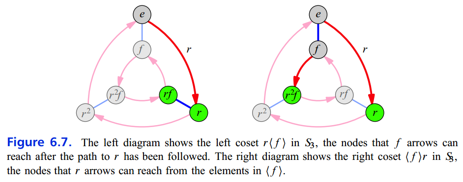

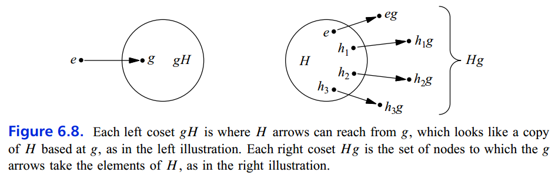

左陪集 和 右陪集 不是一直不相等的。有的时候也是可以相等的。

我们也可以用 乘法表 来计算 陪集：

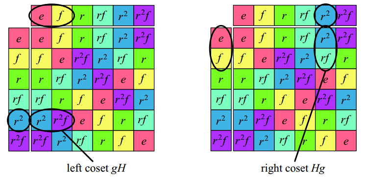

#### 6.5 Lagrange’s theorem 拉格朗日定理

Theorem 6.7. If $H$ is a subgroup of $G$, then each element of $G$ belongs to exactly one left coset of $H$. 

Theorem 6.8 (**Lagrange's Theorem**). If $H<G$, then the order $\left |  H \right |$  of the subgroup divides the order $\left |  G \right |$ of the larger group.

子群 $H$的阶 一定是有限群$G$的 阶 的 因数值.

Definition 6.9 (index). If $H < G$ then the index of $H$ in $G$, written $[G:H]$ , is how many times  $\left |  H \right |$  goes into $\left |  G \right |$ .

​						

​					$[G:H] = \frac{\left |  H \right |}{\left |  G \right |}$

## Chapter 07: Products and quotients

积和商。

上一章讲了 如何把群拆开成 子群 和 陪集。

这章从反方向讲，如何把一个群构建的更大。首先通过 积 的 方法。

#### 7.1 The direct product 直积

**Definition 7.1** (technique for constructing direct products using Cayley diagrams). To create a Cayley diagram of $A×B$  from Cayley diagrams of A and B, proceed as follows.

1. Begin with the Cayley diagram for A.In the example in Figure 7.2, the group $A=C_2$ appears on the left.
2. Inflate each node in the Cayley diagram of A and place in it a copy of the Cayley
  diagram for B.
  In the middle of Figure 7.2, each of the two nodes of $C_2$ grew taller to contain a copy of a Cayley diagram for $C_4$.

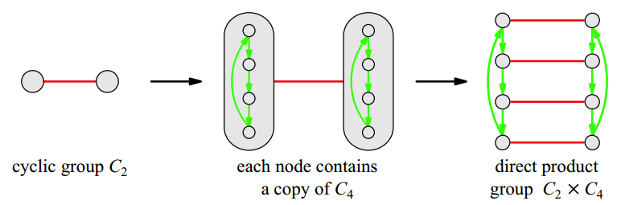

**Figure 7.2. **The construction of a Cayley diagram for the group $C_2×C_4$ , using Cayley diagrams of $C_2$ and $C_4$, as described in Definition 7.1 

因为 $A×B$ 和 $B×A$ 具有相同的结构，所以我们说 The direct product 具有 commutative - 交换性。

**Definition 7.2** (normal subgroup 正规子群). A subgroup $H < G$ is called normal if each left coset of $H$ is also a right coset of $H$ (and vice versa). We indicate that $H$ is a normal subgroup of $G$ by writing $H \triangleleft  G$.

设G是一个群，H是其子群。 若H的左陪集与右陪集总是相等（对任何的a∈G，aH=Ha）， 则称H是G的**正规子群**或**不变子群**，记为H⊴G。

#### 7.2 Semidirect products - 半直积

**Definition 7.4** (rewiring). I call one Cayley diagram a rewiring of another if all the following conditions are met.
(a) The two diagrams must have the same arrangement of nodes.
(b) The diagrams may have their arrows arranged differently.
(c) The algebraic relationships among group elements must be the same in both diagrams.

