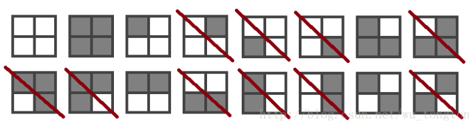

## 等价类问题

参考例文：https://blog.csdn.net/wu_tongtong/article/details/78136028

#### **问题示例1**：给2×2方格中涂黑白两色，有几种方案

但是如果定义一种“旋转操作”，规定逆时针旋转90°，180°，270°后相同的方案算作一种， 
那么答案就变成6种了:

这类问题被称作是等价类计数问题

也就是说，题目中会定义一种等价关系，满足等价关系的元素被看做是同一类元素。这样就可以把这些元素分为很多个等价类，等价类中的元素相互等价。通常题目会让你求出等价类的个数。

等价关系满足**自反性**和**传递性**

- 自反性：A等价于B，则B等价于A
- 传递性：A等价于B，B等价于C，则A等价于C

有了等价关系，所有的元素就会被分成若干等价类， 
每个等价类里的所有元素相互等价，不同等价类里的元素不等价

为了统计等价类的个数,我们需要用一个**置换群G**描述等价关系f,也可以叫做 置换f

**G中任意两个置换的乘积也应当在G中，否则G无法构成置换群**

对于一个置换f，若一个方案经过置换后不变，称s为f的不动点 
将**f的不动点的数目记为C(f)**，则有

**Burnside 定理** ：等价类数目为所有C(f)的和/ $|G|$

换句话说就是 置换群G中 所有的置换 的不动点数目的平均值 = 等价类数目

例如本题中：

“逆时针旋转180°”的不动点：

“逆时针旋转90°”的不动点：

“逆时针旋转270°”的不动点：

“逆时针旋转0°”的不动点：那自然就是原来16种图案了。

根据**Burnside引理**，答案是（16+2+2+4）/4=6

##如何求$C(f)$

#### **方法1**：

我们先把格子编号：

比如”逆时针旋转180°“这个置换就可以看作是轮换（1,3）（2,4）的乘积 
即1,3互换，2,4互换 ,则如果是不动点的话，1和3的颜色一定要一样，2和4的颜色一定要一样 
而这两和轮换不想交，所以互不影响，根据乘法原理一共有2*2=4种方案

#### **方法2**： 

如果置换f被分解成m(f)个轮换，每个轮换内所有格子的颜色不必须相同。【置换如何分解成 轮换，可以参考**《01置换群》** 的学习笔记】

假设有k种颜色，则有 $C(f)=k^{m(f)}$ 
代入**Burnside 定理**表达式后得到**Polya定理**： **等价类个数$L$等于所有置换f的$k^{m(f)}$的平均数**

​		$$L = \frac{1}{|G|} \sum_{f \in  G}^{}C(f) =\frac{1}{|G|} \sum_{f \in  G}^{} k^{m(f)}$$

这时我们用 Polya 定理来解第1道题目：因为有2种颜色，4种置换，这4种置换构成了一个置换群$G$，而且$G$正好是 $S_4$对称群的一个子群。

$$k=2,|G|=4$$

$$m(1,2,3,4)=m((1)(2)(3)(4))=4,m(2,3,4,1)=1,m(3,4,1,2)=m((1,3)(2,4))=2,m(4,1,2,3)=1$$

这时我们可以计算得到： $$L =  \frac{1}{4} (2^4+2^1+2^2+2^1)=  \frac{24}{4}=6 $$

#### 方法3：

当面对一个**循环群（cyclic group）** 求 每个置换的轮换时，可以使用**最大公约数**来求 $m(f)$

$m(f)=gcd(n,i)$, i 为转动幅度，n为染色点的个数，gcd是求最大公约数。

很明显方法3，在遇到n很大的时候， 可以很快算出来$m(f)$。

证明：参考 https://blog.csdn.net/qq_36368339/article/details/76252638

长度为t的一循环节，

$$n*k==i*t$$ , 其中n,k,i,t为正整数，因此等式最小值为 $lcm(n,i)$, 既 $i*t==lcm(n,i)$

$t==lcm(n,i)/i==(n*i/gcd(n,i))/i==n/gcd(n,i)$

$t==n/gcd(n,i)$ ,循环节的个数为： $n/t == gcd(n,i)$

这里要用到 **两个数的乘积等于其最大公约数与最小公倍数的乘积**。

**题型变换**：只规定逆时针旋转180°后相同的方案算作一种.

因为要满足要求“**G中任意两个置换的乘积也应当在G中，否则G无法构成置换群** ” ，所以只能把90度和270度的旋转置换一起去掉了。这样 180度的置换 就能保证 乘法的封闭性。

这时根据 **Burnside引理**，答案是（16+4）/2=10. 眼睛扫一下那16图案，没毛病。

或者用 **Polya定理** 来求解验证一下：

$$k=2,|G|=2, m(1,2,3,4) = 4,m(3,4,1,2) = 2$$

**思考**：

如果现实中遇到无法构成 一个群的 问题咋办？例子暂时没想出来...

---

#### **问题示例2**：将等边三角形的三个顶点用 红，蓝，绿 三种颜色进行着色，问有多少种不同的着色方案？如果：

（1）经旋转能重合的方案认为是相同的？

（2）经旋转和翻转能重合的方案认为是相同的？

解：

（1） 旋转构成的群 $C_3$与 $S_3$**对称群的子群** 置换群G **完全同构**。【真好，这里把同构的知识也引入了】 

$$k=3, |G|=3, m(1,2,3)=3,m(2,3,1)=1,m(3,1,2)=1$$

$$L =  \frac{1}{3} (3^3+3^1+3^1)=11$$  

（2）旋转+翻转 构成的群$D_3$ 与 $S_3$**对称群** 完全同构。

$$k=3, |G|=6,m(1,2,3)=3,m(2,3,1)=1,m(3,1,2)=1，$$

$$m(1,3,2)=m((1)(2,3))=2,m(2,1,3)=m((2)(1,3))=2,m=(3,2,1)=((3)(1,2))=2$$

$$L =  \frac{1}{6} (3^3+3^1+3^1+3^2+3^2+3^2)=10$$  

**思考**：

到这里我们会发现，其实有了  Polya 定理，求这类 等价类计数 问题 的难点不在于颜色，颜色是多少代入k就行了。**难点变成了 确定 置换群 $G$ 的结构**，这个群有多少元素(置换)，每个元素对应的置换是什么样子（确定了置换才能拆解成轮换）。像 示例2 里面的两个 置换群 都是我们比较熟悉的 结构，如果遇到复杂的该如何处理。如何快速的给问题找到 对应的 置换群。

---

#### **问题示例3**：正六面体（正方体）6个面用 红、蓝着色，有多少种方案？旋转重合算同一种方案。【这里的置换群 与 一个空间群 同构】

$$k=2$$, $G$应该是 $S_6$ 的子群，$|S_6|=6!=720 $,而 $|G|$将会是 720的因子。接下来只能具体分析了。

不动变换：$m((1)(2)(3)(4)(5)(6))=6, m_1=2^6=64$

绕面中心连线旋转 90，180，270度[这个和问题1很像], [面中心线总共有3条]：

$$m((1)(2)(4,5,6,3))=3, m((1)(2)(3,4)(5,6))=4, m((1)(2)(6,3,4,5))=3$$ 

$m_2=3*(2^3+2^4+2^3)=96$

绕对梭中点连线旋转180度[总共有6条这种轴]：$m((1,2)(3,4)(5,6))=3, m_3=6*(2^3)=48$

绕对角线旋转120，240度[总共有4条这种轴]：

$m((2,3,1)(5,6,4))=2, m((3,1,2)(6,4,5))=2, m_4=4*(2^2+2^2)=32 $

这里我们能算出总共有24种置换。

$L=\frac{1}{|G|}(64+96+48+32)= \frac{240}{24} = 10 $

思考：这个 示例3 的置换群$G$已经比前面2题要复杂的多了。

---

#### **问题示例4**：项链和手镯【旋转对应的是一个循环群$C_n$，旋转+翻转对应的是一个二面体群 $D_n$】

POJ 2409 用k种颜色的宝石嵌套长度为n的项链，求出本质不同的方案数。分旋转和翻转2种情况讨论，翻转的对称轴又分2种：顶点与中心的连线为轴，相邻顶点的中点与中心的连线为轴。共有2n种置换。

2n种置换，自己想想就能明白为啥是2n了，其中旋转有n种，所有的翻转有n种。

**只考虑旋转**：使用最大公约数来求解。

$L=\frac{1}{n}(\sum_{i=1}^{n}k^{gcd(n,i)})$

**只考虑翻转**：凯勒图画出来会是下面这样。

大概就是一个电风扇的样子，扇叶个数为n。

但是这样是个群么？比如n=3时，让我们先翻转1顶点所在轴，再翻转3顶点所在轴，会得出一个只翻转一次得不到的结果。这样就不满足群运算的封闭性了。所以只考虑翻转是不能用群的方法来计算了。

**旋转+翻转**：

当n为奇数时，顶点到中心的轴与一个相邻顶点的中点的中心的连线共线。每个点对应的翻转置换：$m(f)=((1)(2,n)(3,n-1)....)=1+(n-1)/2$

$$L=\frac{1}{2n}(\sum_{i=1}^{n}k^{gcd(n,i)}+nk^{(1+(n-1)/2)}) $$

当n为偶数时，

顶点到顶点为轴的置换[有(n/2)个这种轴]：$m(f)=((1)(n/2+1)(3,n-1)(4,n-2)...)=2+(n-2)/2$

边中点到边中点为轴的置换[有(n/2)个这种轴]：$m(f)=((1,n-1)(2,n-2)...)=n/2$

$$L=\frac{1}{2n}(\sum_{i=1}^{n}k^{gcd(n,i)}+(n/2)k^{2+(n-2)/2}+(n/2)k^{n/2} )$$

**优化**：

当n很大时，有一些加快 求最大公约数的 运算速度的算法。见《最大公约数与最小公倍数》笔记。

---

Burnside引理 的证明：

https://www.cnblogs.com/gzy-cjoier/p/7470391.html

具体证明可以参照 《组合数学》（第5版）P181 定理4-11）

《组合理论及其应用》（第5章-Polya计数理论，P92） 完全看不下去...

也有证明：

https://www.cnblogs.com/liu-runda/p/8033020.html

